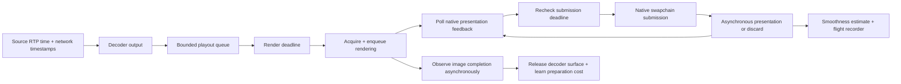

# VRR14: presentation feedback, playout, and reproducible experiments

VRR14 is an experimental replacement pacing path. It uses the current renderer's
native presentation interface and a portable controller shared with a virtual-time
simulator. It does not reuse the previous VRR controller or treat a returned swap,
completed GPU command, or received frame callback as proof of presentation.

## Platform contract and current coverage

| Frontend | Native integration | Timing evidence |
| --- | --- | --- |
| Linux Wayland + EGL | `eglSwapBuffers`, EGL completion fences, `wp_presentation` attached to that surface commit | Per-commit presented/discarded events, native timestamp, refresh sequence, output, and quality flags |
| Linux Wayland + Vulkan/libplacebo | Acquired Vulkan swapchain image, per-image Vulkan timeline completion, deferred `pl_swapchain_submit_frame`/`vkQueuePresentKHR`, `wp_presentation` | Per-commit presented/discarded events with the existing Vulkan HDR color-space and metadata path retained |
| Windows D3D11 | Flip-discard DXGI swapchain, latency waitable object with maximum latency 1, D3D11 event query, `Present(0, ALLOW_TEARING)`, DXGI frame statistics | QPC synchronization sample; frame association only when present and synchronization refresh counters agree; optional composition mode |
| X11, direct KMS/DRM, Windows Vulkan, SDL and other frontends | Existing renderer | The new path explicitly declines; startup logs legacy presentation fallback |

The Linux implementation covers Wayland/EGL SDR and Wayland/Vulkan SDR or HDR.
Vulkan keeps libplacebo's HDR format selection, color conversion, metadata hints,
and overlays. Windows D3D11 keeps its existing HDR rendering; Vulkan is not a
requirement for HDR on Windows. VRR14 does not enable a monitor's
adaptive-sync setting, prove that the compositor has enabled VRR, or measure optical
response time. These remain distinct from receiving presentation timestamps.

The Windows adapter is implemented but needs a Windows SDK build and live
validation. The Linux application and portable tests can be built in the existing
`moonlight-dev` container. A successful build or simulator run does not establish
live compositor accuracy, smoothness, or end-to-end input latency.

Protocol/API references:

- [Wayland presentation protocol](https://gitlab.freedesktop.org/wayland/wayland-protocols/-/blob/main/stable/presentation-time/presentation-time.xml)
  defines the clock ID, association with surface commit, terminal feedback, and
  hardware quality flags. The licensed XML and generated C bindings are vendored.
- [DXGI frame statistics](https://learn.microsoft.com/en-us/windows/win32/api/dxgi/ns-dxgi-dxgi_frame_statistics)
  separates the presented refresh counter from the synchronization sample.
- [DXGI flip-model timing](https://learn.microsoft.com/en-us/windows/win32/direct3ddxgi/dxgi-flip-model)
  documents the present-ID correlation and that `SyncQPCTime` is an approximation
  associated with its synchronization interval. VRR14 never extrapolates it by
  multiplying a counter difference by a nominal fixed refresh period.
- [Waitable swapchains](https://learn.microsoft.com/en-us/windows/uwp/gaming/reduce-latency-with-dxgi-1-3-swap-chains)
  specify swapchain admission control. Its signal is not interpreted as scanout.
- [libplacebo Vulkan swapchain implementation](https://github.com/haasn/libplacebo/blob/v7.360.1/src/vulkan/swapchain.c)
  separates GPU work in flight from presentation and performs `vkQueuePresentKHR`
  during submission. VRR14 prefers mailbox mode when available, preserving native
  ownership/semaphore transitions and avoiding a FIFO presentation backlog.
  The VRR path omits `pl_swapchain_swap_buffers`' additional global command-retirement
  wait: per-image GPU completion and native image acquisition already bound work.
  The throughput effect requires a new live capture; the simulator does not replay
  this driver-side wait.
- [libplacebo Vulkan interop API](https://github.com/haasn/libplacebo/blob/v7.360.1/src/include/libplacebo/vulkan.h)
  transfers image ownership with a semaphore dependency. VRR14 signals a reusable
  timeline value after image rendering, returns ownership with that dependency,
  and waits directly on that value using `vkWaitSemaphores`. Global command
  retirement and `pl_swapchain_swap_buffers` are not presentation evidence.

## Runtime flow



The worker owns the renderer context, controller and presentation observations.
The decoder hands over at most three queued AVFrames; at most two additional
frames remain owned by GPU work, preserving the five-surface pacer budget. Queue overflow,
obsolete deadlines, shutdown, preparation failure, and submission failure have
separate recorded dispositions. Worker statistics reach the decoder through a
locked delta handoff, including the final partial reporting window.

Source RTP timestamps are unwrapped in their 90 kHz clock before conversion.
Decode availability minus source time supplies a sliding transit distribution.
The low transit envelope estimates clock offset; a configurable upper quantile
sets the network/decoder jitter reserve. Reserve grows promptly and drains
gradually, with an explicit maximum. This is a receiver-side mapping, not a
measurement of absolute host-to-client clock offset or input-to-photon latency.

FFmpeg output availability does not imply hardware decode completion. Vulkan
queues rendering with decode/import and image ownership dependencies intact.
A separate observer waits on the image timeline value; the pacing thread can
submit before completion and prepare the next frame. AVFrames remain alive until
that dependency completes. EGL and D3D11 retain synchronous preparation. The GPU
completion record brackets the last unsignaled and first signaled observations.
Native present still performs the final swapchain layout transition. Wayland
feedback attaches to that commit; no empty commit is inserted.

Each decision predicts scanout and subtracts learned compositor lead. Typical
render cost sets the playout offset; its upper tail controls preparation lead.
Preparation can use the entire playout window. After CPU preparation the worker
polls feedback and recomputes the execution target without charging another
render reserve. The first feasible plan, including the display floor already
known at admission, is immutable for measurement. Later replans cannot erase a
miss. No decoder context lock is held during the scheduled wait.

For asynchronous frames, compositor delay begins at the later of submission and
observed GPU completion. The controller waits for both observations in either
arrival order; unfinished GPU work cannot be learned again as compositor delay.
Fresh scanout feedback sets the physical presentation floor. A separate CPU
submission-spacing floor remains active only when that feedback is stale.
Driver operations can still block even though cooperative waits are cancellable.

Recent presentation samples constrain the earliest predicted refresh and, when
the lower refresh limit is known, the latest safe predicted refresh. Missing or
old feedback moves decisions into acquiring/stale modes and removes claims about
the latest scanout boundary. A separate submission-spacing floor prevents a burst
when feedback is missing. Predictions include a reported uncertainty allowance;
they are not hardware deadline guarantees. Nanosecond storage is a time unit,
not a claim of nanosecond measurement accuracy.

Presentation-delay spread remains a prediction uncertainty. It is not added to
the physical minimum refresh interval: doing so can nearly halve throughput when
a fixed-refresh compositor reports two latency phases.

The controller rejects future timestamps, old samples, duplicate/reversed refresh
sequences, invalid clock uncertainty and impossible per-frame ordering. Output
changes clear the timing phase and compositor-cost estimate. Window/output changes
recreate the renderer and worker, so prepared buffers and old display limits are
not reused across a resize or monitor migration.

## Learned reserve

With `adaptive_reserve=1`, calibration learns the combined per-frame readiness
error over a rolling five minutes. Each observation pairs arrival/decode timing,
involuntary CPU scheduling delay, and that frame's preparation service cost,
excluding image acquisition and previously charged GPU work. It does not add
separate component percentiles. Calibration compares two
work schedules using the same source timestamps: the observed receiver workload,
and normal preparation at the mapped source time with no receiver jitter.
Neither schedule contains intentional pacing or cadence smoothing waits.

```
expected arrival   = decode time - receiver timing residual
expected completion = max(previous expected completion, expected arrival)
                      + typical preparation cost
unpaced completion = max(previous unpaced completion, decode time)
                     + dispatch delay + preparation service cost
error          = max(0, unpaced completion - expected completion)
headroom       = max(0, source interval - max(display minimum interval,
                                             typical preparation cost))
reserve target = max(0, learned 99.95% error threshold - headroom - 3 ms)
miss           = error > complete applied buffer + original frame headroom + 3 ms
```

Normal processing already queued by bursty game timestamps belongs to the
expected schedule; it cannot be learned again as receiver jitter. Temporary work
backlogs are staged until an observed idle gap shows they drained. At most 128
samples are staged, with their original observation times, applied buffers and
headroom.
A backlog that exceeds this limit is classified as sustained overload and cannot
train the jitter reserve. Its impossible accumulated debt is discarded; ordinary
learning resumes after processing catches up. Samples from recoveries and
uncertain completion timing are also excluded rather than labeled successes.
An apparent idle gap caused by locally skipped frames cannot qualify a backlog;
that episode is discarded instead of teaching the buffer to hide dropped work.
All eligible samples, including 0–3 ms errors, stay in the five-minute histogram.

Delayed completion retains the original frame's arrival residual, applied
reserve, typical cost, cadence and recovery flags. GPU overlap already charged
to the preceding image is removed from service demand before modeling backlog.
Waiting to acquire a reusable swapchain image is also excluded from service
demand. Capture resimulation consumes service costs, avoiding a second charge
for the previous scheduler's image-acquisition and overlapping GPU waits.
Full elapsed preparation remains visible in statistics and the trace.
An asynchronous completion bracket wider than 500 us cannot train preparation
cost or the cache: observer scheduling delay is not proof of slower GPU work.

Exactly 3 ms beyond the applied buffer plus recovery headroom is allowed;
strictly larger excesses count against the pipeline 99.95% target. This is an explicit engineering tolerance, not a guarantee about
human perception. There is no mandatory 2 ms cushion, including in preparation
lead. The existing 0.5 ms buffer floor and 50 us clock guard remain; the complete
applied buffer and original frame headroom count toward the 3 ms threshold.
Proven cached queue values exclude headroom and the separately added guard so
neither becomes an additional queued delay on restart.
Stable transit latency is absorbed by the source-clock mapping. Paired virtual
work schedules track excess processing backlog without intentional pacing waits. Longer intervals at
lower FPS drain that backlog naturally; earlier buffered queue residence cannot
feed back into a larger jitter estimate. The worker records only current dispatch
and oversleep as scheduling delay, and replay uses the same input. Recovery
resets the virtual backlog so excluded startup stalls cannot leak into later
samples. Headroom is the unused part of one source interval after allowing for
normal preparation and a physical refresh. It is applied once to the target and
miss budget, never deducted from the virtual queues themselves. The five-minute
histogram retains raw errors, so changing content FPS changes the requested
reserve immediately without requiring older observations to expire. Actual
buffer reduction still obeys the release gate and slew limit. This is a recovery
budget, not proof that each frame met its original presentation deadline; native
presentation errors retain their independent, unchanged 3 ms measurement.

The histogram has 401 bins rounded up to 250 us. One-second buckets expire whole
oldest seconds, representing 299–300 seconds of observations. The selected tail
uses the exact empirical nearest-rank 99.95th percentile: `n - floor(n/2000)`.
For 4,292 observations this permits two values above the selected threshold.
The percentile is not replaced by the window maximum or by a percentile of only
misses. Coverage counts all eligible per-frame errors against the complete applied
buffer, original frame headroom and the strict 3 ms tolerance. The overlay labels this as pipeline buffer
coverage and keeps actual presentation timing visible separately.

Cold startup retains one negotiated source interval minus its available
headroom: `min(source interval, max(display minimum interval, initial render cost))`,
subject to the explicit buffer cap and finite queue budget. With the same display
and normal work, 30 FPS does not start with twice the queue allowance of 60 FPS.
Falling content FPS does not enlarge the cold allowance.
Confirmed cadence changes re-anchor the source-clock transit baseline so a
persistent source phase offset is not repeatedly learned as arrival jitter.
Initialization, source/clock recovery and stalled
backlogs are excluded from calibration. Exceptional preparation costs above
`max(25 ms, 3 * typical cost, 2 * source interval)` do not train ordinary jitter;
a cold initialization outlier also cannot seed the typical rendering baseline.
The complete worker trace still records those stalls for diagnostics.

The hard reserve limit is `min(configured cap, 2 * source interval - typical
preparation cost)` for the three-frame queue. This includes room for preparation
and the next queued arrival. It overrides the ordinary drain gate:
waiting for confidence while requesting more delay than the queue can hold would
continually discard frames. A poisoned or excessive cached target cannot bypass
this capacity constraint.
After at least 32 live observations and two seconds without a miss, reserve
can drain toward the five-minute learned threshold minus current headroom and
the 3 ms tolerance. This response gate
is not statistical proof of 99.95%. A miss holds release for two seconds, but
never reinstates the cold-start frame allowance after warmup.
Transient pressure affects the target only while readiness coverage is below
99.95% and the last miss is less than two seconds old. The retained tail continues
to protect against recurring jitter. Buffer motion remains bounded by
`buffer_attack_us` (250 us per selected frame). `buffer_release_us` is now 20 us
per display interval, scaled by elapsed arrival time, rather than per source
frame. Elapsed credit is capped at 100 ms and disabled for new epochs, arrival
stalls and skipped frames. This keeps wall-clock release speed consistent across
source FPS without turning recovery gaps into abrupt corrections. The 32-sample,
two-second gate is an adaptation gate, not five-minute statistical confidence.

Default learned and total buffer caps are 100 ms. Explicit reserve/buffer caps
remain honored. Adaptive mode uses one joint-error estimate; the legacy short-term
transit floor is used only when adaptive calibration is disabled.
Dropped/unavailable frames and compositor/display behavior are not a delivery
guarantee from this readiness model; native feedback measures display smoothness.

The versioned cache `vrr14-delay-profiles.json` preloads a five-minute histogram
of prior bufferable errors. Older histories containing cadence phase, overload
backlog, or the fixed cushion are invalidated. Its mass ages uniformly out over
the first five live minutes;
new observations take its place. This reconstructs a prior distribution, not
individual historic timestamps. Short sessions preserve a more protective
cached distribution rather than overwrite it with a cheaper partial sample.

Each saved successful five-minute session records the largest reserve actually
used in that window (excluding the separate clock guard). Three distinct
successful sessions within 500 us of the same value qualify that value for warm
startup. The larger demonstrated value is retained. Saving the same session
again cannot manufacture another success. A trusted restart begins at that
proven reserve or the current learned requirement, whichever is larger, with the
same short live release gate. Any fresh miss revokes startup trust immediately;
a failed saved session clears the success count. Cold/unproven sessions begin
with one negotiated stream frame interval. Successful cache qualification still
requires a complete five-minute live window. A zero additional reserve is a valid
proven starting value; it still receives the configured timing guard and minimum.
It also requires passing native presentation coverage and no pacing delivery
failures in that window. Unknown presentation quality can save timing history
but cannot earn another proven-start success. Known presentation failure clears
the success count, even when the readiness model reports success.

Cache identity distinguishes host and connection address, bitrate, dimensions,
codec preference, HDR, output/mode, renderer, OS/kernel, and timing configuration.
Only a digest of identity is written. Cached sample counts halve per offline day;
a day-old profile loses startup trust, and entries expire after 14 days. The
cache accepts at most 16 profiles and 256 KiB. Writes remain atomic, locked,
require 240 fresh observations, occur after worker shutdown, and are rate-limited
to once per minute per profile. Phase and temporary pressure never survive a
restart. Profile version 12 and controller identity 17 invalidate earlier model
histories. Negotiated interval and cadence/control settings are part of the cache
identity; a proven buffer cannot silently carry across different workloads.

## Host cadence and Smooth cadence

**Host cadence** preserves source timestamp intervals while buffering receiver
jitter. **Smooth cadence** restores VRR13's 10% interval tracking and 20% phase
correction, bounded by a 6 ms phase cap. The cap adds no unconditional queue wait;
phase advance is also bounded by available reserve. It regularizes short-term
host variance and adapts to rate changes without interpolating image content.
The old smoothing preference migrates once; later UI changes are preserved.
`cadence_slew_us` limits interval correction per sample (default 1 ms), and
`smoothing_delay_us` is the phase cap.

Recovery preserves the useful VRR13 policies within the new native-timing
controller. An isolated source interval outside 0.5–2.5 times the learned period
restarts the phase without teaching the cadence estimator that interval. Three
consistent outliers admit a sustained rate change. A trimmed mean preserves
alternating source intervals, and locally skipped frame IDs retain their source
time rather than lowering the estimated rate. Smooth phase adjustment is bounded
by `smoothing_delay_us`, independently of the larger jitter-buffer limit.

Arrival gaps above the larger of 25 ms and 2.5 source periods exclude the gap and
a bounded number of following frames from ordinary jitter learning. This keeps
one stalled backlog from filling the reserve for the entire sample window. Large
clock-map discontinuities restart the transit history while preserving native
scanout anchors and submission spacing. Recovery is explicitly recorded with its
reason, source period and remaining exclusion count.

Below the physical VRR floor, the display/compositor may repeat frames using LFC.
VRR14 records lower-range misses and observed sequence gaps; it does not issue
duplicate application frames to claim that a slow source stayed inside the range.
Unknown floor information remains unknown. Wayland's `refresh=0` is valid.

## Smoothness telemetry

Overlay text rasterization and renderer notifications run on one background
worker, with one coalesced pending update per overlay. Producers only copy the
latest text. Renderer detachment waits for an active callback and invalidates
unpublished work, preventing updates into a destroyed renderer.

Vulkan reuses two overlay textures, waits for destination-image completion on
the overlay worker, and exchanges the completed texture under a short lock. The
video path continues using the previous overlay while its replacement is built.
The upload callback only releases host memory; it is not used as proof of GPU
readiness, because [libplacebo's fallback uploads can release their input before
the destination image is complete](https://github.com/haasn/libplacebo/blob/v7.360.1/src/vulkan/gpu_tex.c).
D3D11 retains its existing texture until the replacement resources are created.

The overlay reports **presentation cadence error p99** and feedback coverage,
alongside **pipeline buffer coverage (+3 ms)** against 99.95%. Sustained overload
pauses buffer calibration. **Presentation on target** separately compares
native presentation with the unchanged first plan. Absolute error strictly
greater than 3 ms and confirmed discards count as misses in the rolling
five-minute window. Missing/invalid feedback cannot count as success. The overlay
shows feedback coverage and the duration actually measured, requiring 30 measured
frames and 90% resolved feedback before showing a rate. Cached history initializes
calibration only; local pacing drops remain a separate delivery statistic.

Queue delay counts waiting before preparation plus any wait from GPU completion
to CPU submission. Preparation spans start through observed GPU completion,
including outstanding GPU work. These partition decode-to-readiness/submission
without treating CPU submission as proof of completion or presentation.

The cadence diagnostic compares each correlated presentation interval with its
actual source timestamp interval, bounded by the display ceiling. Variable source
FPS therefore does not become an artificial hitch. Known locally skipped frames
are compared with the normal source period so pacing drops remain visible.
Missing or unusable feedback breaks the measurement interval instead of being
interpreted as a screen hold. Source restarts and output changes re-anchor it.
At least 30 measured intervals and 90% resolved feedback coverage are required;
otherwise the overlay reports insufficient feedback.

An internal diagnostic percentage remains in logs and legacy lab fields. It uses
a deadband of `max(0.5 ms, 10% of expected interval)` plus clock uncertainty, then
weights excess cadence error by displayed duration. It is not the 99.95% buffer
target or a validated human perception model. It cannot observe motion content,
pixel response, tearing or brightness flicker. Runtime cadence values cover the
recent 256 measured intervals; session diagnostics cover the whole scored segment.

`smooth_cadence` accepts 0 or 1. Do not tune the display's physical range as
though it were a freely adjustable controller parameter.

`adaptive_reserve` accepts 0 or 1; `reserve_max_us` and `reserve_boost_us` set the
learned reserve limits. `vrr-lab measure CAPTURE` applies the source-relative cadence
diagnostic after the first retained complete checkpoint. `target_99_95_met` uses
actual unchanged-deadline presentation evidence only; it is null without adequate
feedback or a complete five-minute retained window.
Session hitch counts and worst hold now cover the whole scored segment; the lab's
`recent_cadence_error_p99_ms` explicitly names its 256-interval window. Worker
shutdown also logs a full-session cadence diagnostic separately from recent telemetry.

## Verification

- `tests/vrr14/tests.pro`: clock/ordering rules, RTP wrap, checkpoint restore,
  smoothing and rate changes, smoothness noise tolerance and feedback coverage,
  configuration validation, isolated stalls, queued followers and recovery across
  genuine source-rate changes.
- `tests/vrr14/overlay.pro`: real font rasterization, producer progress while a
  renderer callback is blocked, coalescing, detachment, replacement and timing.
  Run `test-vrr14-overlay /absolute/path/to/moonlight-qt/app` to locate the font.
- `tests/vrr14/profile.pro`: profile isolation, bounded storage, short-session
  rejection, write throttling, lock contention, expiry and corrupt-cache recovery.
- `tests/vrr14/worker.pro`: real worker with a fake presenter; frame capacity,
  ownership, submission before completion, exact replay, cancellation and statistics
  deltas. Build the application/common
  library in `build-tests/vrr14` first.
- `tests/vrr14/vulkan.pro`: native Vulkan GPU completion using HDR-capable float16
  image storage, readback, asynchronous submission behind an unsignaled imported-image
  dependency, cancellation,
  host-copy fallback uploads, and reuse of two BGRA overlay textures.
  It opens no window. Exit 77 means no Vulkan device was available. This verifies
  synchronization, not HDR signaling, compositor accuracy, or optical output.
- `python3 tests/vrr14/test_lab.py build-tests/vrr14/lab/vrr-lab`: deterministic
  simulation, exact replay after recorder wrap, truncated input rejection,
  missing-feedback behavior, fixed-refresh simulation, concurrency and resume.

Before treating the native path as production-ready, validate Windows compilation,
Wayland and DXGI feedback quality/coverage on real VRR displays, monitor moves,
minimize/restore, device loss, HDR on Linux/Vulkan and Windows/D3D11, and
capture-based prediction error. Native Vulkan acquisition/recreation and driver
teardown may block internally even though the per-image semaphore wait is cancellable.
