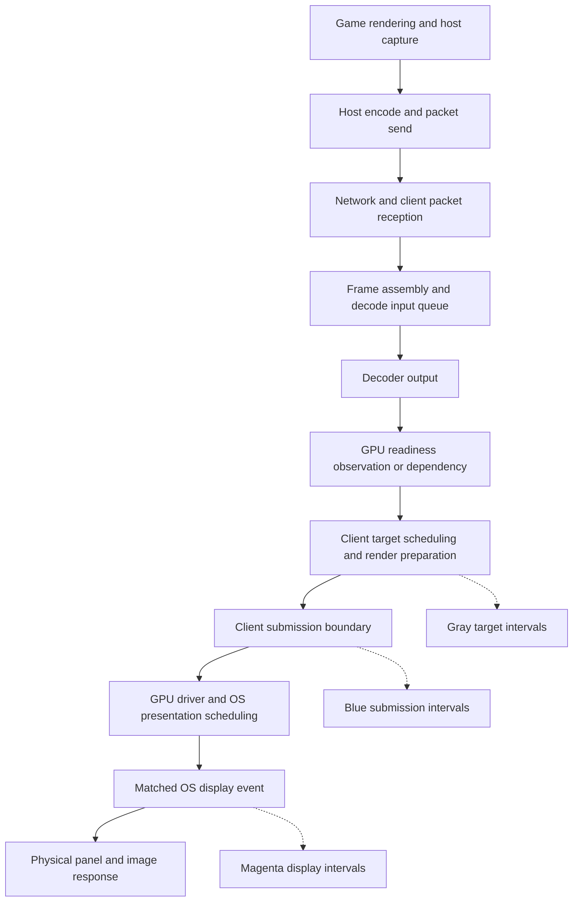

# Troubleshooting Moonlight client timing and display frametimes

The blue line answers **how evenly Moonlight submits frames**. The magenta line answers **how evenly the operating system reports displaying matched frames**. Compare both with the gray planned-cadence line to locate the first observed divergence, then use receive, decode, scheduling and presentation evidence to identify its cause.

A line moving up means a longer interval between frames; moving down means a shorter interval. It does not directly mean that network latency, decode cost or total input latency increased or decreased. A network problem can disturb both lines, but so can a host stall, client overload, a late CPU wake or a GPU/display scheduling problem. The first task is to distinguish these cases.

This guide describes this fork's source at `39d10abf` and the inspected common library at `9ab99497`, reviewed on October 9, 2026. The installed executable, selected presenter and capture metadata determine whether these rules apply to a live session. An executable hash is stronger identification than the stable `vrr-lite` directory name. Historical captures and comments describe earlier policies and should not be used as the current policy's defaults. No particular live capture is diagnosed here.

The three-lane history is populated by the active VRR worker. Under legacy/fixed pacing, enabling the graph toggle does not establish that this history or native feedback is available.

For navigation, start with [graph interpretation](#1-read-the-graph-correctly) and [symptom patterns](#3-locate-the-first-disturbance), then choose [host](#4-diagnose-host-timing), [network](#5-diagnose-network-delivery-and-packet-assembly), [decoder and GPU](#6-diagnose-decoder-and-gpu-readiness), [CPU scheduling](#7-diagnose-client-cpu-scheduling) or [display](#8-diagnose-magenta-display-timing). The [repeatable test sequence](#11-run-a-repeatable-troubleshooting-sequence), [capture workflow](#12-capture-the-evidence) and [frame-level investigation](#13-analyze-one-incident-frame-by-frame) turn those clues into evidence. [Replay limits](#14-use-replay-for-the-questions-it-can-answer) explain when a tuning result is trustworthy.

## 1 Read the graph correctly

| Lane | What each value measures | What it does not measure |
| --- | --- | --- |
| Gray Planned cadence | Interval between scheduled client targets for consecutive graph observations | Raw host frame timing or decoder work duration |
| Blue or cyan Client submissions | Interval between successful client submission boundaries | Time spent in the Present call, decode time, network transit or total latency |
| Magenta Display events | Interval between matched OS-reported display events | Optical panel scanout, pixel response, every physical refresh or click-to-photon latency |

The source calls the blue lane **Client submissions**, with a cyan color. The text statistic **Client timing**, shown in advanced stats, is a separate quality percentage. Keep those two meanings separate when describing a problem. [Graph definitions](../app/streaming/video/timinggraph.h#L30), [colors and captions](../app/streaming/video/overlaymanager.cpp#L53), [advanced stats](../app/streaming/video/ffmpeg.cpp#L1553).

For consecutive accepted graph observations `i-1` and `i`:

```text
planned interval = target[i] - target[i-1]
blue interval    = submission[i] - submission[i-1]
magenta interval = displayEvent[i] - displayEvent[i-1]
```

Magenta requires valid feedback for both observations in the same graph generation and backend; discontinuities start a new generation. Feedback often arrives later; it is attached to the original submission by identity. A magenta point appearing late on the screen does not mean that the frame itself was displayed at that polling time. The blue boundary uses a valid timestamp inside the presenter operation when supplied, otherwise its entry boundary; it does not use the operation's return time. A long return can still delay processing of the next frame. [History and matching](../app/streaming/video/timinggraph.h#L50), [submission boundary](../app/streaming/video/ffmpeg-renderers/pacer/vrrpacingworker.cpp#L130).

The chart has several deliberate limits:

- It shows the latest **240 submitted frame observations**, refreshed about **10 times per second**. The horizontal axis is frame sequence, rather than uniform elapsed time. At a steady 120 FPS it covers roughly two seconds; at 60 FPS roughly four seconds.
- Its reference is the **median planned interval** in the visible history. A sustained rate change moves the reference. Do not compare the shape of graphs with different references as though they used a fixed absolute axis.
- All three lanes use the same interval scale, normally **reference plus or minus 2 ms**. They are vertically separated; their physical distance on screen is not latency between stages.
- Values **within 1 ms of the reference are drawn flat**. The captions retain raw latest and peak intervals. Flat blue and gray therefore mean visually flat within that display rule, not mathematically identical timing.
- **Red edge marks mean clipping**. A 3 ms excursion and a 30 ms stall can both hit the edge. Read the peak or trace for magnitude.
- Missing or invalid display feedback creates a **gap**, rather than a fabricated long magenta interval. Gaps and `unavailable` do not establish a dropped frame.
- History is recorded for successful, noncancelled submissions. A dropped frame can make the next surviving observation span more than one source frame, producing long gray and blue intervals even when the host cadence was steady. Rebases and discontinuities can instead break the curve.

These rules come from the [drawing implementation](../app/streaming/video/overlaymanager.cpp#L25), [graph history](../app/streaming/video/timinggraph.h#L77) and [worker recording](../app/streaming/video/ffmpeg-renderers/pacer/vrrpacingworker.cpp#L895).

## 2 Understand why a late frame often creates an up and down pair

Nominal frame intervals provide a useful scale:

| Source rate | Nominal interval |
| --- | ---: |
| 30 FPS | 33.33 ms |
| 60 FPS | 16.67 ms |
| 90 FPS | 11.11 ms |
| 100 FPS | 10.00 ms |
| 116 FPS | 8.62 ms |
| 120 FPS | 8.33 ms |
| 138 FPS | 7.25 ms |
| 144 FPS | 6.94 ms |

Consider a synthetic 100 FPS stream with intended submissions at 0, 10, 20 and 30 ms. If the third frame is submitted at 23 ms and the fourth retains its original 30 ms opportunity, blue reads 10, **13**, **7** ms. A single late event created both the upward and downward excursions. The shorter interval is recovery toward the original schedule, not necessarily a second fault.

There is a useful exact relationship for any such sequence:

```text
e[i] = submission[i] - target[i]
blueInterval[i] - plannedInterval[i] = e[i] - e[i-1]
```

If lateness remains constant, interval spacing can look smooth despite that lateness. If lateness suddenly changes, the graph shows a spike or a short/long pair. Similarly, variable submit-to-display delay changes magenta intervals even with perfectly regular blue intervals. A fixed 15 ms display delay can leave magenta flat; a delay changing from 8 to 13 ms adds 5 ms to that interval.

At the display, recovery is constrained by its refresh capability. A 120 Hz panel cannot show a fresh full frame every 7 ms. Near its maximum refresh, a long interval cannot always be paid back immediately by an equally short one; native synchronization, queueing or replacement can change the pattern. Treat short/long pairs as clues to a timing disturbance and its recovery, then locate the first late stage.

Three questions must be answered separately:

1. Are frames spaced evenly?
2. How much latency is present?
3. Do the images contain evenly sampled motion?

All lines can be flat while latency is high or the host repeats the same image. Conversely, an intentional game frame-rate change can move all lines without a client defect. Neither FPS averages nor interval graphs examine the image content.

Regularly repeating patterns deserve different tests from isolated spikes. Display intervals clustered near multiples of the refresh period can indicate fixed-refresh quantization, a missed presentation opportunity or driver repeats; confirm the active mode and feedback before attributing them. A slowly repeating beat can arise when actual host/source and output rates differ slightly, even if their UI labels both round to 60 or 120. Check the measured rates, limiter, source timestamps and output mode. A long warmup trend suggests changing load, temperature, power or learned timing state; it is not enough to name which one from the line shape.

## 3 Locate the first disturbance



The graph is a triage tool. The following patterns nominate a boundary to investigate; they do not establish a hardware diagnosis.

| Pattern | First interpretation | Evidence to check next |
| --- | --- | --- |
| Gray regular, blue irregular, magenta irregular | Variation was introduced before or at the client submission boundary and reached display feedback | Frame arrivals, assembly, decoder queue, GPU readiness, preparation, deadline overshoot, native call boundaries |
| Gray and blue regular, magenta irregular | Additional variation appeared after the measured submission boundary, assuming valid matched feedback | GPU completion and queueing, presentation mode, independent-flip coverage, compositor/output transitions, driver and power state |
| Gray irregular and blue follows it | The client plan itself changed | Raw RTP intervals, buffer steps, cadence smoothing, mapping/rebase/rate changes, surviving-frame gaps |
| All three spike together | The same long interval exists throughout the observed plan/submission/display sequence | Host/source stall **or** client drop, changed target/buffer, or recovery; distinguish them using frame IDs and trace |
| Blue irregular, magenta regular | The native display path may be absorbing submission variation | Matched sample coverage, queueing and submit-to-display delay; check latency and replaced frames |
| Magenta missing or gappy | Display timing is unavailable or unqualified for these observations | Active backend, output identity, present IDs and feedback validity; do not invent timing from gaps |
| Lines flat, motion still judders | The chart's flat zone, sparse feedback, repeated images, uneven host motion sampling, panel behavior or smaller timing variation may matter | Raw interval tails, game capture/Present evidence, video content and physical observation |
| Buffer grows while lines improve | Some variability may be absorbed by additional waiting | Attribution and buffer-action fields, latency distributions and whether growth hits its cap |
| Buffer at cap and blue remains irregular | The policy lacks capacity or work is unabsorbable | Service time, queue/backlog, cap pressure, delivery tails and drops |

Do not diagnose the host solely because gray spikes. Gray is a client target sequence. Do not diagnose the monitor solely because magenta spikes: GPU work and OS scheduling occur before the reported event, and the event is not an optical sensor. Also, blue/gray can contain variation hidden by their 1 ms flat zone. [Metric boundaries](../architecture.md#5-clock-domains-and-latency-boundaries), [native evidence limits](../architecture.md#103-native-evidence-limits).

## 4 Diagnose host timing

The host supplies the images and source timestamps. The client can retime or delay presentation opportunities and drop stale frames within its policy, but it cannot manufacture a missing image, undo a game simulation stall or make duplicate images contain new motion.

Potential host causes include a game CPU/GPU bottleneck, shader compilation, asset loading, periodic background work, capture waiting on a display/compositor grid, encoder delay, competing capture software, changes in the host display path, and send batching. These are hypotheses until the host or ingress evidence supports them.

### Source cadence and the game

Inspect raw host RTP intervals and the **Incoming smoothness (host)** statistic. That statistic uses 30 consecutive source intervals before client decode and pacing. It measures timestamp consistency around the recent mean, rather than adherence to the FPS you requested. Stable 60 FPS and stable 120 FPS can both score 100%. It clears qualification on missing/invalid source observations and can show `N/A` while rebuilding its window.

Its soft score is:

```text
host score = 100 / (1 + (sourceIntervalStdDev_ms / 6)^4)
```

For example, 2 ms standard deviation still scores about 98.78%. A high score does not prove no hitches, no repeated image content or sufficient game FPS. A single stall ages out after 30 later intervals. Inspect the actual source intervals and stall count around the reported symptom. [Source metric](../app/streaming/video/incomingframetiming.h#L7), [qualification and meaning](../architecture.md#14-metrics-and-a-useful-investigation-method).

If RTP timestamps become irregular while first-arrival, assembly and client work are otherwise consistent, investigate the host's game/capture timestamp path. Client evidence cannot separate game simulation, game Present, host capture and source timestamp generation by itself. Host-side game Present/capture/encode records are the next evidence.

A source interval over 25 ms is reported separately by several cadence analyses. At 30 FPS, 33.33 ms is ordinary cadence, so a raw `>25 ms` count needs rate context; it is not automatically an abnormal stall. Some controller gates additionally use 1.5 times the fitted source period. Read the specific metric's definition rather than treating every excluded interval as equivalent.

### Host processing and capture

Moonlight reports host processing min/max/average when the host supplies nonzero samples. The host field is in tenths of a millisecond; the overlay converts it to milliseconds. It is an aggregate host report, not an independently measured client clock boundary and not necessarily game rendering time. Zero or an absent row is unavailable evidence, not proof of zero host work. [Host reporting](../app/streaming/video/ffmpeg.cpp#L1371), [protocol timing fields](../moonlight-common-c/moonlight-common-c/src/Limelight.h#L163).

For a controlled host test, keep the stream format, network path and client display fixed. Repeat the same camera pan after reducing game rendering load alone. Compare source timestamp tails, game frame times, host processing tails and the three graph lanes. If host cadence improves first and downstream lines follow, host work is a stronger candidate.

Use one intentional game/frame-limiter arrangement, then verify actual game and captured cadence. Multiple caps and synchronization mechanisms can interact; identical requested numbers do not prove identical clocks. Test the limiter change alone, reconnect when session configuration changes, and retain its setting in the notes. A 1000 Hz virtual display or host refresh hint is not proof that the game generated 1000 images or that timestamps match optical capture.

This fork sends a client refresh hint and a VRR request to compatible hosts. Their implementation determines what those hints do. Standard Sunshine behavior and a custom Vibeshine/Vibepollo path should not be treated as interchangeable. [Negotiation and host hints](../architecture.md#32-host-frame-limiter-discovery).

## 5 Diagnose network delivery and packet assembly

Network behavior affects timing through **when usable frame data becomes available**. Steady average throughput is insufficient if individual frame bursts overflow a bottleneck, or if packets arrive late enough to miss the current client slot.

| Condition | Possible blue or magenta effect | Why it may be invisible in ordinary loss stats |
| --- | --- | --- |
| Variable delivery without loss | Buffer absorbs it, or blue becomes late and magenta follows | Every frame still arrives |
| Reordering or FEC recovery | Assembly waits; usable frame arrives later | Repaired packets can leave no whole-frame loss |
| Unrecoverable conventional-codec loss | Frame/reference recovery or IDR disruption; later output can gap | Whole-frame recovery has different behavior from packet counting |
| PyroWave detail loss | Blur/shimmer, possibly late/partial readiness | Partial images count as delivered frames |
| Burst queue overflow at a NIC, switch, AP or dock | Packet groups disappear; assembly/loss rises | A throughput test or low RTT can still look good |
| Host send batching | First-packet or assembly timing becomes uneven | Receiver cannot separate it from transport without host egress evidence |

### Keep loss and delay counters separate

**Packet loss** concerns missing video shards. **Whole-frame loss** concerns missing frame-number observations. **Client playback drops** concern local frames the client discards rather than submits. **Skipped before decoding** means stale compressed work was skipped locally. These are distinct counters; a local drop is not automatically network loss.

With PyroWave, delivered frames can contain missing detail. The current source propagates lost-packet counts to the pacing frame and excludes those frames from smoothness/prediction learning eligibility, so their lateness should not train additional standing buffer. This does **not** recover detail, make transport reliable or guarantee that a late partial frame has regular displayed timing. Verify the live executable before applying this October 6 policy to a capture. [Loss propagation](../app/streaming/video/ffmpeg.cpp#L2835), [controller eligibility](../app/streaming/video/ffmpeg-renderers/pacer/vrr/vrrtimingcontroller.cpp#L1230).

The PyroWave receive path can release partial data under bounded tail-silence/on-time rules while protecting critical prefix data. Parity, critical-data completeness, interior holes and missing final packets have different conditions. Long assembly on a lossy frame need not be decoder work. The specific receiver policy matters, and controller-only replay begins too late to test an alternate packet-release algorithm. [Current receive correction](../architecture.md#streaming-vrr-and-timing-architecture), [expiry conditions](../moonlight-common-c/moonlight-common-c/src/RtpVideoQueue.c#L743), [deadline arming](../moonlight-common-c/moonlight-common-c/src/RtpVideoQueue.c#L1037).

**0% network frame loss therefore does not clear the network**, particularly for PyroWave. Read detail/partial-frame warnings, packet-loss fields where available, receiver logs, reassembly tails and adapter counters.

### Distinguish RTT from frame delivery

The overlay's average network latency uses the control connection's RTT and variation. It is not synchronized one-way video transit, and it does not describe each UDP frame burst. Low RTT can coexist with video packet loss or late assembly. A ping test checks a different workload. [RTT reporting](../app/streaming/video/ffmpeg.cpp#L1386).

Client reassembly duration is approximately:

```text
assembly = frame_reassembled_us - frame_receive_us
```

It spans first packet reception to usable assembled data. Serialization, host packet spacing, loss recovery, reordering and receiver work can all contribute. It is not the total time from host capture to client arrival. A late first packet versus the mapped source slot narrows the problem to upstream delivery, but does not distinguish delayed host sending from network transit.

The host RTP clock and client monotonic clock have different epochs. The controller estimates a mapping from observed decode completion; it does not synchronize the machines. Do not subtract an arbitrary host timestamp from client wall-clock time to claim one-way network latency. [Clock domains](../architecture.md#5-clock-domains-and-latency-boundaries).

### Network tests that provide useful discrimination

1. Repeat the same workload with both endpoints wired where possible. Compare a direct/client NIC path with the dock or USB adapter path, then change one cable/port/adapter at a time.
2. Lower only the requested bitrate substantially. If reassembly/loss and timing improve repeatedly, delivery pressure is implicated, although bitrate can also change host encoding and compressed-data processing.
3. Check actual link negotiation, adapter errors/discards and AP/switch counters. Record counter changes over the test interval rather than interpreting lifetime totals.
4. Test reverse UDP traffic from host to client in a separate test window. A TCP transfer measures sustained delivery and can conceal retransmissions; it does not validate the live UDP cadence.
5. If Wi-Fi is necessary, test close to the AP on a clean 5/6 GHz connection and compare against Ethernet. Repeatable differences are stronger evidence than an isolated signal-strength reading.

Sunshine documents bottleneck overflow from frame bursts and a reverse UDP iPerf test. Its suggested loss threshold is a connectivity guideline; for troubleshooting a high-rate interactive stream, aim for negligible loss and inspect actual streaming evidence. Its own documentation also notes newer networking improvements, so do not assume every installed host uses the older burst behavior. [Sunshine network troubleshooting](https://docs.lizardbyte.dev/projects/sunshine/master/md_docs_2troubleshooting.html).

For example, on the host:

```text
iperf3 -s
```

On the client, substitute the real host IP and a deliberate starting rate:

```text
iperf3 -c HOST_IP -t 60 -u -R -b 100M
```

Run this separately from gameplay, then raise the test rate only as needed to characterize the path. A clean synthetic test is supporting evidence, not proof that the game's packet bursts or driver timing are clean.

Near line rate, FEC, headers, audio/control traffic, other applications and burst behavior matter in addition to the requested video bitrate. As a scale calculation, 900 Mbps takes 7.5 ms of ideal serialization on a 1 Gbps link for a 120 FPS frame's average data, before extra overhead; the source period is only 8.33 ms. The actual packet sizes, frame-size variation and protocol definition determine the real headroom. Do not tune to the adapter's printed link speed alone.

Treat MTU, offloads, interrupt moderation, energy-saving settings, traffic shaping and link-speed changes as specific experiments after identifying the delivery problem. They can trade throughput against CPU load or change other traffic. Record the previous value and the measured result of each change; avoid changing all adapter options together.

## 6 Diagnose decoder and GPU readiness

A decoded-frame API returning does not always mean that the GPU finished producing the image. Some paths return a surface with a dependency that the renderer must honor later. This distinction is especially important for PyroWave.

### What the decode measurements include

The standard decoding average includes elapsed time from the compressed frame's enqueue to decoder output, excluding deliberate decode hold. The separately shown decoder-input queue component also excludes that hold. On asynchronous paths, output can represent submitted GPU work rather than completed GPU work. The worker's explicit decode-sync wait measures time the CPU waited on a completion primitive; zero can mean completion was already ready, that observation was unavailable, or that correctness is enforced through a GPU-queued dependency. It is not a universal GPU execution duration. [Decode accounting](../app/streaming/video/ffmpeg.cpp#L2841), [async tagging](../app/streaming/video/ffmpeg.cpp#L2879), [CPU decode wait](../app/streaming/video/ffmpeg-renderers/d3d11va.cpp#L1375), [GPU dependency](../app/streaming/video/ffmpeg-renderers/d3d11va.cpp#L1344).

For Windows PyroWave, Vulkan writes shared plane textures used by D3D11, with decode and renderer-release fences establishing ownership. Its decoder output time can precede actual completion. A low ordinary decode number can coexist with GPU wait, backpressure or late display. CPU parse/push/submit phase spans and zero-cost fence polls also cannot establish total shader execution time. [PyroWave sharing](../architecture.md#streaming-vrr-and-timing-architecture), [phase timer implementation](../app/streaming/video/pyrowave/pyrowavedecoder.cpp#L22), [phase event emission](../app/streaming/video/ffmpeg.cpp#L2373).

The nominal target is not a per-stage performance guarantee. At 120 FPS, serial work that takes 10 ms per frame cannot indefinitely fit inside an 8.33 ms source cadence just by adding a standing buffer. Queue growth, stale skips, surface pressure and drops are useful signs of sustained overload. Parallel work can overlap, so diagnose the actual critical path rather than adding every GPU/CPU duration as if all were serial.

### Controlled decoder tests

| Change one factor | What the experiment tests | Read together with the graph |
| --- | --- | --- |
| Lower stream resolution | Pixel/plane work, memory movement and render cost | Decode/preparation tails, queue depth, client drops and display timing |
| Lower source FPS | Throughput demand and time available per frame | Same metrics, recognizing that deadlines and VRR regime also changed |
| PyroWave 4:4:4 to 4:2:0 | Plane footprint and chroma processing | Decode/render work and actual selected format |
| 10-bit to 8-bit | Storage/processing format | Actual plane format, GPU readiness and presentation timing |
| HDR off | HDR/format/presentation path | Confirm whether bit depth, bitrate or color pipeline changed too |
| Switch codec | Different host encoder and client decoder workload/path | Negotiated codec/profile, hardware decoder, adapter and receive pressure |
| Close local GPU-heavy apps | Client GPU contention | GPU readiness, preparation and matched display intervals |

These tests indicate which load matters; they do not isolate a component automatically. Resolution changes host work and delivery too. FPS changes display headroom. Codec changes encoding, packet sizes and decode. Use the stage evidence to determine where the improvement first occurs.

In this Windows PyroWave implementation, 4:4:4 has three full-resolution planes, while 4:2:0 has one full-resolution and two approximately quarter-area planes. For even image dimensions, that is twice the plane-pixel footprint. Ten-bit output uses 16-bit plane storage rather than 8-bit storage. These are storage relationships, not a prediction that execution time will exactly double. [Surface formats](../app/streaming/video/ffmpeg-renderers/d3d11pyrowave.cpp#L15).

A GPU supporting HEVC or AV1 in general does not prove hardware support for every profile, chroma, bit depth and resolution. Confirm what Moonlight actually initializes. NVIDIA documents decoder-generation capabilities and a dedicated decode engine; those capabilities do not apply to PyroWave's Vulkan processing path. [NVDEC capabilities](https://docs.nvidia.com/video-technologies/video-codec-sdk/13.1/nvdec-video-decoder-api-prog-guide/index.html).

### Surface pressure and adapter paths

Check for `no free output surface`, decoder backlog, skipped-before-decoding counts and incoming/decoded/rendered FPS divergence. A surface can be held by downstream rendering, so exhaustion need not mean the decoder itself is the original bottleneck. Lower work, verify recovery, and inspect who retains surfaces before considering a larger pool.

Windows startup logs identify shared/separate devices and decoder texture bind/copy access. Current policy keeps compatibility copies in some cases and uses direct binding only where its capability rules permit. Check render/output GPU identity; blindly forcing a different GPU can introduce cross-adapter transfer or break adaptive eligibility. Avoid bypassing bind/fence checks as a casual optimization. [Binding policy](../app/streaming/video/ffmpeg-renderers/d3d11bindpolicy.h#L3), [renderer setup logs](../app/streaming/video/ffmpeg-renderers/d3d11va.cpp#L647).

## 7 Diagnose client CPU scheduling

A frame can be ready but miss its submission opportunity because the pacing thread did not run on time. Aggregate CPU utilization does not describe the availability of the relevant thread during a submillisecond deadline.

The current worker attempts a high-resolution Windows waitable timer, then polls in a bounded final region with a CPU pause hint. It requests multimedia scheduling priority for dedicated video threads. These mechanisms reduce avoidable timing delay but remain subject to preemption, interrupts, driver work and OS policy. [Waiter implementation](../app/streaming/video/ffmpeg-renderers/pacer/vrr/vrrtargetwaiter.cpp#L65), [priority requests](../app/streaming/video/videothreadpriority.h#L20).

Start with the trace:

- `render_wait_overshoot_us` and `target_wait_overshoot_us` show the waiter finishing after its deadline.
- `render_deadline_already_elapsed` and `target_deadline_already_elapsed` show that it entered with a deadline already past; investigate the preceding work.
- `render_scheduler_delay_us` and `target_scheduler_delay_us`, when valid, estimate coarse-wait overshoot beyond the active margin. They are **not total OS scheduling delay** and can miss preemption inside the final polling region or after it returns.
- `prepare_us`, decode waits and `present_call_us` distinguish preceding service/blocking from timer wake behavior. A long call return can also hurt a later frame even if the current submission boundary was on time.

Check logs for `Video thread priority:` accepted/rejected requests. Acceptance means the request succeeded, not that no runtime scheduling delay occurred. A rejection helps identify a setup or policy issue.

Then make controlled tests: same scene and configuration, with local capture tools, browser video, GPU overlays and OEM monitoring utilities closed; then reintroduce one at a time. Compare AC power and a performance power mode with the same sustained workload. Record effective CPU/GPU clocks and temperatures when symptoms worsen after warmup. These are reversible tests, not instructions to disable every power feature.

For a reproducible Windows event, capture ETW with WPR and inspect WPA's CPU Usage Precise and DPC/ISR views. A thread in **Ready** state can run but is waiting for CPU; **Waiting** means it awaits an event; **Running** means it has CPU. Correlate the actual pacing-thread interval with interrupts and the responsible module. A high DPC peak elsewhere in the capture is insufficient attribution. [Microsoft CPU analysis](https://learn.microsoft.com/en-us/windows-hardware/test/wpt/cpu-analysis).

A USB/network adapter can affect two different boundaries: it may lose/delay packets, or its driver work may interfere with client scheduling. A direct-NIC versus dock test should compare both receive/reassembly evidence and deadline/ETW evidence. Calling either effect simply a network problem conceals the repair needed.

The application already manages its streaming timer hint and per-thread requests. Process Real Time, global timer tools, fixed affinity and registry scheduling changes are poor starting points; they can change unrelated behavior without identifying the late boundary.

## 8 Diagnose magenta display timing

Blue measures submission timing. GPU completion, driver queueing, OS presentation scheduling and display behavior can still alter what happens afterward. Magenta is useful evidence when its sample identity and coverage are valid.

### Windows presenter and feedback coverage

Eligible Windows VRR sessions attempt the composition presenter by default. Unsupported hardware or failed setup falls back to DXGI. Startup logs determine which path is active.

On the composition path, only independent-flip events matching the surface, output adapter/source and increasing present ID become graph display events. Composition-frame statistics are excluded. On the DXGI fallback, refresh-reference samples are not substituted for per-frame display events. Thus switching paths or losing independent-flip coverage can make magenta unavailable even though frames are still presented. [Composition feedback filtering](../app/streaming/video/ffmpeg-renderers/d3d11composition.cpp#L241), [native feedback distinction](../architecture.md#103-native-evidence-limits).

Verify Windows' actual output refresh, the display's adaptive-sync setting, the driver's per-display VRR configuration, the active output/GPU and the stream's requested FPS. The fork requires effective V-sync for its VRR session mode and forces the applicable fullscreen path. Unchecking V-sync can therefore select another pacing mode; a smoother-looking comparison is not evidence about the same VRR policy. Microsoft documents flip-model/tearing capability requirements for the DXGI VRR path. [Session selection](../app/streaming/session.cpp#L697), [Microsoft VRR requirements](https://learn.microsoft.com/en-us/windows/win32/direct3ddxgi/variable-refresh-rate-displays).

The current Windows source accepts full-refresh streaming; a below-refresh rate is an available headroom experiment, not an absolute requirement. On a 120 Hz display compare 120 FPS, 116 FPS or 100 FPS under a repeatable scene. On 144 Hz compare 144, 138 or 120. This changes GPU/decoder/network demand as well as display spacing, so a lower-rate improvement needs stage evidence before assigning cause. A single late frame near the ceiling has less room for immediate recovery.

Below the panel's adaptive range, low-framerate compensation can repeat frames on the driver's schedule. The current diagnostic pause uses a **20 ms gap assumption**, roughly 50 FPS, and a **250 ms settling period**. It does not discover every panel's actual floor. `paused below VRR range` is a scoring state, not certification of the monitor's advertised range or a disabled VRR setting. [PresentTiming pause logic](../app/streaming/video/ffmpeg-renderers/pacer/vrr/presenttiming.h#L22).

### What to test when magenta changes first

1. Confirm matched feedback and backend before interpreting a percentage or shape.
2. Reduce client GPU contention and compare GPU readiness/preparation/display timing.
3. Compare the same output with one display active versus the existing multimonitor setup. Keep its resolution/refresh/VRR fixed, and record any backend or independent-flip coverage change.
4. Close presentation hooks, overlays, local capture and animated windows that might alter presentation. Restore one at a time.
5. Compare AC/performance state and driver version only with a repeatable baseline; do not combine a driver update with several other changes.
6. Inspect native/ETW display timing and present results if CPU submission remains regular. Preserve unmatched/ambiguous feedback counts.

Display cable bandwidth, HDR/output format, dock/display routing and monitor processing are also candidates when the actual output mode changes or optical behavior disagrees with OS timestamps. The graph does not measure pixel response, TV motion processing, backlight flicker or VRR brightness flicker. Use physical observation for those questions; an OS interval alone cannot prove their cause.

`MOONLIGHT_VRR_COMPOSITION=0` is a developer-level backend comparison, captured at renderer initialization. It requires reconnecting and changes feedback availability and presentation behavior. Use it only as a labeled experiment with normal startup logs and timing evidence; removal of magenta after fallback is not proof that the problem disappeared. [Backend selection](../architecture.md#104-composition-presentation-and-display-timing).

### Present timing issues

**Present timing issues (30s)** estimates display-added unevenness relative to planned and submitted spacing, with uncertainty and the panel's fastest period accounted for. **Hitches** counts severe added intervals; **Worst** reports the largest added error. A handful of severe stalls can be obvious while the percentage is tiny.

This statistic is diagnostic and does not drive the current adaptive buffer. Its absence or zero count is meaningful only with fresh scored samples and sufficient feedback coverage. Below-floor pauses and missing feedback remove evidence. [Scoring formula](../app/streaming/video/ffmpeg-renderers/pacer/vrr/presenttiming.h#L56).

### Linux and macOS distinctions

On Linux, Wayland/Gamescope presentation feedback and Vulkan resource/queue behavior differ from Windows' composition path. A Present return is still not compositor completion. On AMD Linux, **High-performance GPU power while streaming** is a useful labeled experiment for magenta-only variation correlated with clock ramping. The current setting requests a supported per-stream performance hold; it is Linux-only, does not override manually chosen clock state, and has a power cost. It is not a Windows GPU-power control. [Linux presentation](../architecture.md#linux-vulkan-presentation), [power setting scope](../app/gui/SettingsView.qml#L1841).

On macOS, the native Metal path uses the actual screen's adaptive refresh range and native fullscreen eligibility. Drawable availability, GPU completion and output changes can affect progress. Its drawable presentation timestamps are OS observations, rather than physical pixel timing. An external fixed-refresh display or a changed active screen can alter qualification; reconnect after changing the display arrangement and verify the actual renderer/range. Do not carry a Windows independent-flip or tearing-flag interpretation into a Metal capture. [Metal eligibility and feedback](../architecture.md#macos-metal-presentation).

## 9 Understand the buffer and Reduce judder

More waiting can absorb some arrival/readiness variation, trading latency for timing regularity. It cannot increase sustained decoder/GPU throughput, fix missing images, or remove post-submission display work. The current policy requires attributed, absorbable late readiness before growing the standing buffer; a poor visual score alone is insufficient.

The default preset settings in this source are:

| Preset | Configured source-frame allowance | Quality target | Reporting history | Interval tolerance |
| --- | ---: | ---: | ---: | ---: |
| Low Latency | 0.5 frame | 99.00% | 60 s | 0.50 ms |
| Balanced Target | 1 frame | 99.50% | 120 s | 0.50 ms |
| Smooth | 4 frames | 99.99% | 300 s | 0.25 ms |

Saved/custom values can differ. The source-frame allowance is a cap input, **not a promise of that many queued frames or that much total latency**. Queue capacity, render allowance, smoothing and actual fitted cadence can impose a lower limit. Read the recorded resolved settings and applied cap. Old 8/16 ms constants and historical 2/2/4-frame descriptions do not establish today's cap. [Current presets](../app/settings/vrrtimingoptions.h#L14), [resolved production parameters](../app/streaming/video/ffmpeg-renderers/pacer/vrr/vrrtimingcontroller.cpp#L168), [capacity formula](../architecture.md#93-delay-update-and-capacity-formulas).

The advanced Client timing/Smoothness percentage is a **severity-weighted interval quality**, not the percentage of all frames that were perfect and not physical display smoothness. Current revision 7 applies tolerance to the qualified one-second mean interval error, then accumulates severity-weighted loss over evaluated time in the preset history. Reporting and buffer control use that same score; isolated spikes can disappear beneath tolerance. Drops and unobserved gaps must be examined separately. A long reporting history can preserve score debt while the current second looks good; it need not mean the buffer must remain at its previous level. [Active scoring](../architecture.md#92-revision-7-interval-buffer-and-feedback).

Its intended motion interval follows the mapped source interval plus deliberate cadence smoothing. Buffer/render target movement does not redefine that intended motion. The graph's gray interval, however, is the full target-to-target difference and includes those target changes. Consequently, blue-minus-gray is a useful execution comparison but is **not the complete formula for the Client timing score**. Gray and blue can track a buffer step together while the scored motion interval still changes. [Intended interval construction](../app/streaming/video/ffmpeg-renderers/pacer/vrr/vrrtimingcontroller.cpp#L1181), [submission scoring](../app/streaming/video/ffmpeg-renderers/pacer/vrr/vrrtimingcontroller.cpp#L2375).

Current responsive production restores cached readiness histograms for diagnostics only. Cached tails do not raise or hold the live buffer request. Its live interval qualification starts fresh, requiring at least 500 ms and 32 consecutive valid intervals; after later sequence breaks, adaptation needs a second of requalification. Do not attribute a growing current buffer to an old cached tail without verifying the actual policy and request evidence. Earlier replay policies used caches differently. [Calibration contract](../architecture.md#94-persisted-calibration).

Current production bounds request growth to 250 microseconds per 250 ms and applies growth at no more than 125 microseconds per frame. Release follows qualified clean recovery and is gradual; short clean patches need not instantly drain accumulated delay. The source's release rule uses eight seconds of qualified clean evidence and 250 microseconds per second. Check the actual capture's parameters because historical release laws differ. A buffer-changing step can appear in gray and blue; that is deliberate target movement, not automatically a new network fault. [Active policy values](../architecture.md#81-resolve-the-live-policy-before-reading-parameters).

Interpret buffer status as an action with a reason:

| Status or evidence | Meaning | Next action |
| --- | --- | --- |
| Learning or qualification | Insufficient qualified interval history | Continue the matched workload and inspect sequence breaks |
| Late-work growth | Eligible late readiness is requesting protection for later frames | Find the first late stage and measure added latency |
| Growth capped | Requested additional delay cannot fit the applied limit | Check clipping, load and delivery tails; do not presume it was absorbed |
| Work not absorbable | Serial work/backlog cannot be repaired with more standing delay | Reduce demand or repair service bottleneck |
| Clean-time/history/current-pressure hold | Release requirements are not yet met | Identify repeated fresh pressure versus old reporting debt |
| Releasing or minimum | Protection is draining or at its effective floor | Check current timing and latency, rather than judging only the old quality score |

The attributed frame, attempted growth and clipped growth help distinguish demand from applied latency. The overlay's reason is not a diagnosis of a particular network/GPU fault. [Buffer telemetry fields](../app/streaming/video/ffmpeg-renderers/pacer/vrrpacingworker.cpp#L84).

**Reduce judder** moderates source timestamp short/long variation within the available cushion. It does not blend images, create missing game frames or guarantee even optical motion. It may improve adjacent client intervals while making them less faithful to raw host spacing and adding a few milliseconds of timing allowance. It has readiness bounds and resets around discontinuities/rate transitions. Change it alone and reconnect. [Smoothing behavior](../architecture.md#83-cadence-smoothing).

A useful test is Balanced versus Smooth with the same Reduce judder setting. If larger protection improves blue but magenta retains additional variation, investigate display/GPU behavior separately. If no preset restores throughput and client drops continue, buffering is unlikely to be the primary repair. Do not raise tolerance just to improve the percentage; that changes what is counted.

## 10 Use the stats without double counting

| Signal | Useful question | Important limit |
| --- | --- | --- |
| Incoming FPS | How many frames reach decoder ingress? | An average can conceal bursts and gaps |
| Decoded FPS | Can decoding progress at the delivered rate? | API output may precede GPU completion |
| Rendered FPS | How many frames are submitted successfully? | Submitted is not optical confirmation |
| Network frame drops | Are frame observations missing before local presentation? | Delivered partial frames can conceal packet loss |
| Client drops and pre-decode skips | Is local work being discarded? | Indicates a symptom; identify why it became stale |
| Host processing min/max/average | Is reported host work variable? | Aggregate, optional host evidence |
| Incoming smoothness | Are recent source RTP intervals consistent? | Soft 30-interval score, not content/perfect pacing |
| RTT and variance | Is the control path responsive? | Not per-frame one-way video delivery |
| Assembly duration | How long to assemble usable data after first arrival? | Includes sender spacing and receiver recovery |
| Decoder queue and decode output timing | Is compressed work backing up or decoding slowly? | Separate async completion |
| GPU decode wait | Did the worker wait for observed decode completion? | CPU wait and measurement coverage, not full GPU runtime |
| Frame queue delay | How much local queue/pacing time is measured? | Includes intentional waiting; not all network delay |
| Rendering and GPU-ready wait | Is preparation/submission delaying progress? | Rendering includes CPU calls/dependencies, not a universal GPU duration |
| Client timing/Smoothness | How severe is evaluated client interval error? | History/tolerance change meaning; excludes some evidence |
| Present timing issues/Hitches/Worst | Did matched display intervals gain extra unevenness? | Backend coverage and below-floor pause matter |

For successful frames, current worker accounting partitions decoder-output-to-present-return time into explicit decode synchronization, rendering/preparation plus submission-call time, and residual queue/pacing/other client time. **Applied buffer is a scheduling allowance and must not be added again** as though it were another measured execution stage. GPU-ready submeasurements can overlap preparation/submission. Individual stage p99 values do not add into a total p99. Use a common frame population for sums and report sample coverage. The trace report separately constructs a finer partition from ordered frame boundaries. [Worker measurement boundaries](../app/streaming/video/ffmpeg-renderers/pacer/vrrpacingworker.cpp#L925), [overlay accounting](../app/streaming/video/ffmpeg-renderers/pacer/pacertelemetry.h#L291), [observed report partition](../scripts/report-vrr-latency.py#L34).

## 11 Run a repeatable troubleshooting sequence

Start by preserving the configuration where the symptom occurs. Record the executable hash/version, host build, client/display/adapter, actual output mode and refresh, requested/negotiated stream format, bitrate, FPS, VRR/V-sync, latency settings, Reduce judder, HDR/chroma/bit depth, network route and diagnostic state. Confirm the active presenter in the log.

Choose a repeatable **gameplay** scene with the motion that reveals the problem. A desktop or idle stream can validate connectivity but may not exercise the same frame sizes, GPU load or host motion. Use a short 60–90 second reproduction, then a longer confirmation for intermittent or warmup problems. A short run can identify a boundary; it cannot establish a five-minute quality target.

For each change, run A, B and A again, or repeat in reversed order. Keep the scene, duration, overlay/tracing state and other settings fixed. Record actual changes in automatic settings; for example, HDR or resolution can also alter auto bitrate. Preserve warm/cold calibration state rather than deleting caches to make a result look better.

| Order | Single experiment | Improvement that supports the candidate |
| --- | --- | --- |
| 1 | Baseline with graph and stats | Establish the first lane and stage that changes |
| 2 | Lower bitrate alone | Loss/assembly improve first, followed by client timing |
| 3 | Direct/wired NIC path versus suspect dock/Wi-Fi | Delivery or scheduling evidence changes with that path |
| 4 | Lower resolution alone | Decode/GPU/preparation tails and drops improve first |
| 5 | Lower FPS alone | Throughput/headroom improves; inspect the changed VRR regime |
| 6 | Compatible conventional hardware codec versus PyroWave | Confirm actual path and where costs change |
| 7 | PyroWave chroma/bit depth changes individually | Plane workload and readiness improve |
| 8 | Reduced host game load alone | Host/game/capture cadence improves first |
| 9 | Client background/overlay load removed | Wait/preparation/presentation interference improves |
| 10 | Same output with one display active | Magenta/presentation path changes with output setup |
| 11 | Balanced/Smooth or Reduce judder change individually | Eligible pre-submission variation is absorbed with measured latency cost |

Use the graph's first disturbance to choose the next row rather than mechanically trying every option. If only magenta changes, prioritize native/GPU/display evidence. If packet/assembly loss is already established, prioritize delivery. If the game stalls before capture, fix the host before tuning client buffer numbers.

A broad low-load reference such as 1080p60 SDR 4:2:0 on a compatible hardware codec can establish whether the failure disappears under light demand. It changes several factors together and cannot identify which one fixed it. Step back toward the original format one factor at a time. Moonlight's upstream troubleshooting also suggests bitrate reduction and a very low-demand stream to separate capacity issues. [Moonlight troubleshooting](https://github.com/moonlight-stream/moonlight-docs/wiki/Troubleshooting).

Count success using the same measurements: fewer visible hitches, better raw interval/jerk tails, sufficient native sample coverage, lower drops, and acceptable latency. A higher rounded percentage or unchanged average FPS alone is insufficient. Compare p95/p99 and rarer tails when available, not only the mean.

## 12 Capture the evidence

Toggle the chart with **Ctrl+Alt+Shift+F** and the stats with **Ctrl+Alt+Shift+S**. They are separate toggles. The controller equivalents are Select+L1+R1+Y/Triangle for the graph and Select+L1+R1+X/Square for stats.

For the in-app workflow:

1. Enable VRR and **Settings → VRR diagnostics → Trace VRR frames for debugging**.
2. Reconnect. Reproduce the same gameplay and record the elapsed moment of the visible issue plus its form: pause, hitch, repeated frame, tear, shimmer or uneven motion.
3. Disconnect normally so the recording can finish.
4. Use **Open diagnostics folder** and **Export latest recording (ZIP)**.
5. Preserve client and matching host logs; disable tracing after the investigation and reconnect when needed.

In-app recordings live under the resolved Desktop's `vrr-diagnostics`, one folder per stream. They include the main trace/connection segments, session log, capture metadata and current deep GPU sidecars when produced. Metadata records requested settings, executable hash and completion. Export is packaging, not proof of trace integrity or replay exactness. Diagnostics can add CPU/storage overhead; keep their state identical across A/B or measure the overhead separately. [Capture workflow](vrr-diagnostics.md#user-workflow), [current deep tracing](gpu-live-tracing.md#live-vaapivulkan-diagnostics).

The existing Windows share launchers are a different workflow:

```text
\\allytwo\ChaseShare\Moonlight VRR Diagnostic.cmd
\\allytwo\ChaseShare\Moonlight VRR Alignment Diagnostic.cmd
```

They use local `%USERPROFILE%\vrr-traces` during streaming and copy results to the share after Moonlight exits. An external trace destination takes precedence over the in-app setting. Do not enable competing collectors for the same run or redirect live capture to a network path. The alignment launcher adds probes, so use it as a separately labeled experiment.

Client process logs also live in `%LOCALAPPDATA%\Temp\Moonlight-<epoch>.log`, rather than the portable directory. Host logs belong to the separate Sunshine host. Match session time and settings; client and host monotonic epochs are not interchangeable. [Deployment and tracing instructions](../AGENTS.md).

For deeper Windows cases, the repository documents a Full Diagnostic ETW/PresentMon collection workflow. Check that the described launcher and dependencies actually exist on the installed machine before using it. Preserve raw ETL, recorder success/coverage/lost-event diagnostics and matching sidecars. A generated PresentMon CSV is not sufficient proof of matched frames or complete ETW capture. The correlation tool reports missing/ambiguous matches instead of guessing. [Windows collection and matching](windows-stream-sandbox.md#capture).

## 13 Analyze one incident frame by frame

Find the frame where the long interval begins and inspect its predecessor and successor. Match source frame/RTP identity, submission ID, backend and epoch. GPU surface addresses are reusable; they are insufficient identity by themselves.

| Boundary | Main fields or evidence | Question |
| --- | --- | --- |
| Source | `rtp_timestamp`, `sender_interval_us`, `source_period_us`, frame IDs | Did source timing or frame continuity change? |
| First delivery | `frame_receive_us` | Did the data start arriving late relative to the fitted source timeline? |
| Assembly | `frame_reassembled_us` minus `frame_receive_us`, packet/partial logs | Was usable frame data delayed after first arrival? |
| Decoder queue | `decode_submit_us` minus `frame_reassembled_us` | Was compressed work waiting? |
| Decoder output | `decoder_output_us` minus `decode_submit_us` | Was decoder submission/output service delayed? |
| Completion/handoff | `decode_complete_us`, `decode_sync_wait_us`, `pacer_arrival_us` | Was output actually GPU ready, and when did the worker get it? |
| Worker queue | `dequeue_us`, arrival/completion queue depths, `disposition`, `dropped` | Was old work waiting or discarded? |
| Controller | `source_time_us`, `target_us`, `original_target_us`, `cadence_smoothing_us`, rate/rebase flags | Did the plan itself change? |
| Wake | render/target wait entry/final/overshoot/valid scheduler fields | Was the thread late reaching its planned opportunity? |
| Preparation | `prepare_start_us`, `prepare_end_us`, `prepare_acquire_us`, `prepare_render_us`, `prepare_flush_us`, GPU-ready bounds | Was readiness or resource acquisition late? |
| Submission | `submission_boundary_us`, presenter timestamp validity, `submit_error_us`, `present_call_us` | Did actual submission spacing depart from the plan? |
| Buffer | action, attributed frame, request before/after, attempted/clipped growth, hold/cooldown | What future adjustment did the evidence authorize? |
| Native/display | backend, present result/ID, `latch_time_kind`, correlation validity/uncertainty | Is the event a qualified display event for this exact submission? |
| OS scheduling | ETW thread-ready/running/waiting, DPC/ISR, GPU/presentation events | What blocked progress at the late boundary? |

Names and available columns vary with capture schema and optional extensions. Check validity fields before using zeros as measurements. Native `RefreshReference` and a `DisplayEvent` are different evidence kinds. The trace calls some display observations `latch_*`; the name does not turn every such row into an actual display timestamp. [Trace header](../app/streaming/video/ffmpeg-renderers/pacer/vrrpacingworker.cpp#L48).

Work backward from the first late boundary rather than blaming every high number downstream. If packets assembled late, later decode/target misses may be consequences. If preparation ended on time but submission moved late, inspect final waits, locks and native call boundaries. If submission was on time but display spacing gained error, inspect the native/GPU queue. Check the preceding frame's long Present return too, since it may prevent the worker from processing the next frame promptly.

Average evidence narrows a category; a frame-correlated timeline establishes ordering. Receiver data alone still cannot separate host send delay from network transit, and OS display data still cannot certify optical scanout.

## 14 Use replay for the questions it can answer

Immediately before each analysis, enumerate the applicable capture locations again. For the share-launcher workflow those are `%USERPROFILE%\vrr-traces` and `\\allytwo\ChaseShare\vrr-traces`; in-app captures live under Desktop `vrr-diagnostics`. Include connection segments/full-diagnostic subfolders for the selected recording where relevant. Select the newest **completed** capture unless a particular capture was named. A newer active file is not a completed baseline. Record full path, size, UTC modification time and SHA-256; match sidecars by the complete trace basename or capture identity.

With the current matching Windows replay utility, run a fresh baseline with no overrides, using a new output file:

```powershell
$tracePath = 'C:\path\to\selected-completed-capture.vrrtrace'
$replayPath = (Resolve-Path '.\build\tests-vrr\vrr\release\vrrreplay.exe').Path
$baselinePath = Join-Path '.\build' ('timing-baseline-original-{0}.json' -f [guid]::NewGuid().ToString('N'))

& $replayPath $tracePath --require-exact-baseline --output $baselinePath
$replayExit = $LASTEXITCODE
if ($replayExit -ne 0) {
    throw "Replay failed with exit code $replayExit; inspect its diagnostic output"
}
$baseline = Get-Content -LiteralPath $baselinePath -Raw -ErrorAction Stop | ConvertFrom-Json
if (-not $baseline.capture.recorded_sequence_integrity_valid -or
    -not $baseline.fidelity.baseline_exact) {
    throw "Capture is exploratory: the strict replay baseline failed"
}
```

Use a distinct output filename for each baseline so prior evidence is not overwritten, and check the actual process result before trusting output. Inspect matching launcher metadata, capture/sidecar clean footers, dropped/truncated rows, diagnostic-readiness fields and backend-specific evidence as well. A JSON file can exist after a failed gate. The current code can parse schemas 3–5 but sets strict `baseline_exact` only for qualifying schema 5. Older launcher prose saying schema 4 is replay-grade does not override the current gate. [Exactness predicate](../tests/vrr/vrrreplay.cpp#L6077), [capture fidelity](../architecture.md#13-trace-architecture-and-replay-fidelity).

A failed exact baseline does not erase useful observed timing. It means subsequent policy sweeps are exploratory and cannot support strict A/B proof. Exact replay itself proves reproduction within the recorded software model, not that a changed controller will cause identical host sends, admission, GPU queueing, native display behavior or panel response.

For observed component reports, the repository provides:

```text
python scripts/report-vrr-latency.py SELECTED_TRACE --output observed.json --markdown observed.md
python scripts/decode-vrr-trace.py SELECTED_TRACE selected.csv
```

The first reads the selected trace directly and reports observed boundaries/distributions. The second expands the raw trace when frame-level investigation needs it. These reports do not substitute for the replay gate. Consult specialized audit tools' backend/field assumptions before using their output as a native-display verdict.

For parameter sweeps, use one versioned config with many named scenarios and replay's own parallelism; do not launch an outer parallel process loop. Keep baseline and candidate outputs separate. Lead with **presented jerk** and latency, then report sender-spacing fidelity separately. The replay's presented fields use submission timing as a presentation proxy; they are not newly simulated optical display events.

```text
interval[i] = presentationProxy[i] - presentationProxy[i-1]
jerk[i]     = abs(interval[i] - interval[i-1])
sender residual[i] = interval[i] - corresponding source RTP interval
```

A policy following jittery host timestamps faithfully can have a small sender residual but large short/long interval jerk. Raw jerk also includes host cadence changes. Report source stalls separately, plus p95/p99 and p99.5/p99.9/p99.95 where available, the share of adjacent intervals changing by over 2 ms, latency mean/p50/p95/p99, drops, drift, safety bounds and native sample coverage.

Ignore a scenario marked **saturated** as a meaningful live latency prediction: fixed recorded admission can fall behind while a real client would shed work. Replay cannot validate a changed packet assembler, codec, network adapter or GPU/display path. After a controller edit, rebuild diagnostics, rerun exact/candidate/stress checks against the same identified capture and perform live confirmation. [Counterfactual limits](../architecture.md#133-counterfactual-model-limits), [replay investigation rules](../AGENTS.md).

## 15 Recognize common misleading conclusions

| Claim | Correction |
| --- | --- |
| Blue jumped, so the network is bad | Blue records submission spacing; identify the late upstream stage |
| All lanes jumped, so the host stalled | Client drops, buffer/target movement and recovery can also span observations |
| Magenta jumped, so the monitor is defective | GPU/driver/OS work and feedback coverage must be checked first |
| Magenta disappeared, so the fix worked | The backend may simply no longer provide qualified events |
| Decode is under 1 ms, so the GPU is cleared | Async completion, render work and later GPU queues remain |
| 0% network loss means no lost packets | Delivered PyroWave detail-loss frames can preserve whole-frame counts |
| Ping and a speed test are good, so streaming transport is good | They do not reproduce video UDP bursts, reassembly or exact driver workload |
| Smoothness 99.99% means 99.99% of displayed frames were perfect | It is weighted client interval quality over qualified evidence |
| Larger buffer will fix anything | It cannot create throughput or repair post-submission work |
| The graph is flat, so latency is low | Constant latency does not disturb intervals |
| A new profile or higher tolerance fixed timing | It may only change the score, starting state or classification |
| A source-stall count over 25 ms is always abnormal | Interpret it in the actual source-rate context |
| A replay JSON proves the run passed | Check exit code, exactness, integrity and evidence coverage |
| Current source explains an old live capture exactly | Identify the captured executable/policy/schema first |

## 16 Choose the repair from the evidence

**For blue timing problems**, first verify source continuity and ingress. If delivery is late, repair the sender/network/adapter path and choose sustainable bitrate. If ingress is normal but decode or preparation is late, reduce pixel/format/FPS demand or repair the decoder/GPU path. If readiness is on time but submission is late, investigate worker wakeups, locks, present blocking and OS scheduling. Use larger protection only for eligible variation that fits the pipeline's sustained capacity.

**For magenta timing problems with regular submissions**, confirm genuine matched display-event coverage, then inspect client GPU work, native presentation state, output/VRR setup, compositor interference and power/driver behavior. Do not grow the client buffer merely to improve a display-side diagnostic. Where OS timing and visible motion disagree, inspect host image content and physical panel behavior.

**For both lines**, locate the first change in the frame chain and confirm it through a repeatable one-factor experiment. An improvement is credible when the relevant stage tails, drops, interval behavior and visible symptom improve together without an unacceptable latency cost.

The most productive first comparison for this setup is the problem workload at its current settings, then a substantially lower bitrate with all other values recorded, followed by a direct-NIC versus dock-path test if delivery evidence changes. If receive/assembly remain clean, prioritize resolution/format/codec and client GPU/scheduling tests. If only matched magenta intervals gain error, move directly to the presentation investigation. This ordering is conditional on the evidence; the guide does not identify the current live cause without a matching capture.
